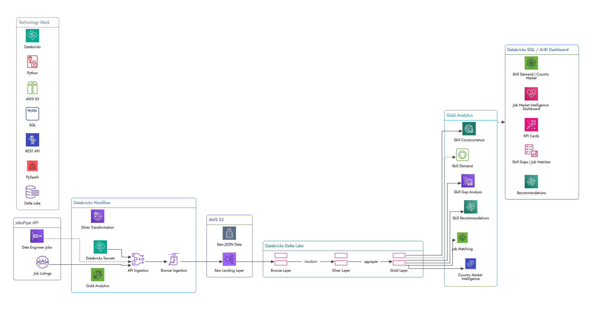

# Job Market Intelligence Platform

An end-to-end Data Engineering project that ingests Data Engineer job listings from the JobsPipe API, stores raw data in Amazon S3, processes it through a Databricks Medallion architecture, and produces job-market intelligence and skill-gap analytics through Delta Lake and Databricks AI/BI.

The project is designed to answer practical questions such as:

* Which technical skills are most demanded in Data Engineering jobs?
* Which countries have the most opportunities?
* How well does a Data Engineering profile cover the skills required by current jobs?
* Which skills are missing from the profile?
* Which technologies commonly appear together?
* Which skills could be prioritized for further learning?

---

## Architecture



### Data Flow

```text
JobsPipe API
     │
     ▼
Databricks Workflow
     │
     ├── API Ingestion
     │
     ├── Bronze Ingestion
     │
     ├── Silver Transformation
     │
     └── Gold Analytics
              │
              ▼
        Databricks Delta Lake
              │
              ▼
       Databricks SQL / AI-BI
              │
              ▼
      Job Market Dashboard
```

Amazon S3 is used as the raw landing zone before the data enters the Delta Lake layers.

---

## Technology Stack

| Technology       | Purpose                                     |
| ---------------- | ------------------------------------------- |
| Python           | API ingestion and data processing           |
| REST API         | Job market data source                      |
| JobsPipe API     | Data Engineer job listings                  |
| Databricks       | Data engineering platform and orchestration |
| PySpark          | Distributed data transformation             |
| Delta Lake       | Reliable data storage and processing        |
| Amazon S3        | Raw data landing zone                       |
| SQL              | Analytics and dashboard queries             |
| Databricks AI/BI | Job market visualization                    |
| Unity Catalog    | Data organization and governance            |
| GitHub           | Version control                             |

---

## Pipeline Architecture

The pipeline follows the **Medallion Architecture**.

### 1. Raw Layer

Job listings are retrieved from the JobsPipe API and stored as complete JSON responses in Amazon S3.

Raw files are organized by ingestion date:

```text
s3://job-market-pipeline-raw/jobs/
└── YYYY-MM-DD/
    ├── jobs_page_1_*.json
    ├── jobs_page_2_*.json
    └── ...
```

The raw layer preserves the original API response for traceability and downstream processing.

---

### 2. Bronze Layer

The Bronze notebook reads raw JSON files from S3 and extracts individual job records.

Key operations include:

* JSON parsing
* Job record extraction
* Duplicate job ID removal
* Delta Lake storage
* MERGE-based upserts

Bronze table:

```text
job_market.bronze.jobs
```

---

### 3. Silver Layer

The Silver layer transforms Bronze data into a clean, analysis-ready dataset.

Transformations include:

* Flattening nested API fields
* Extracting employment status
* Extracting job source
* Converting salary fields to numeric values
* Converting timestamps
* Normalizing technology lists
* Removing unnecessary nested columns
* Deduplicating job records

The Silver layer also performs data quality checks for:

* Required fields
* Duplicate job IDs
* Negative salaries
* Invalid salary ranges
* Timestamp parsing
* Timestamp ordering
* Remote/onsite values
* Country codes

Silver table:

```text
job_market.silver.jobs
```

---

## Gold Analytics

The Gold layer converts the cleaned job data into business-oriented analytics.

### Skill Demand

Identifies the most frequently requested technologies across Data Engineer job postings.

```text
job_market.gold.skill_demand
```

### Country Market Intelligence

Provides job counts and work-arrangement information by country.

```text
job_market.gold.country_market
```

### Profile Skill Coverage

Compares the skills in a Data Engineering profile against the technologies appearing in job postings.

```text
job_market.gold.job_matches
```

This includes:

* Matched skills
* Missing skills
* Number of matched skills
* Job skill coverage
* Profile skill coverage
* Job URL

> Profile skill coverage measures technology overlap. It is not intended to represent a complete hiring or qualification score.

### Skill Gap Analysis

Identifies frequently requested technologies that are not currently included in the profile skill set.

```text
job_market.gold.skill_gaps
```

### Skill Co-occurrence

Identifies technologies that frequently appear together in Data Engineer job postings.

```text
job_market.gold.co_occurence
```

### Skill Recommendations

Combines skill gaps with observed job-market demand to identify technologies that could be considered for further learning.

```text
job_market.gold.recommendations
```

---

## Databricks Workflow

The complete pipeline is orchestrated using a Databricks Workflow.

```text
00_api_ingestion
        ↓
01_bronze_ingestion
        ↓
02_silver_transformation
        ↓
03_gold_analytics
```

Each task depends on the successful completion of the previous task.

This allows the entire pipeline to run as an automated workflow instead of executing notebooks manually.

---

## Dashboard

The Gold tables are consumed by a Databricks AI/BI dashboard containing:

* Total jobs analyzed
* Countries represented
* Unique skills
* Remote jobs
* Top demanded skills
* Country market distribution
* Job skill coverage
* Skill gaps
* Skill co-occurrence
* Skill recommendations
* Work-arrangement analysis

The dashboard provides a business-facing view of the data produced by the engineering pipeline.

---

## Data Quality

Data quality checks are implemented in the Silver transformation layer before downstream analytics.

Examples include:

```text
Required fields
Duplicate job IDs
Negative salaries
Invalid salary ranges
Timestamp parsing
Timestamp ordering
Remote values
Country codes
```

The Bronze and Silver layers use job IDs as the primary identifier for deduplication and MERGE operations.

---

## Security

API credentials are not stored in the source code.

The JobsPipe API key is stored using **Databricks Secrets** and retrieved securely during pipeline execution.

AWS access is managed through an IAM role and Databricks Unity Catalog storage credentials.

Sensitive files such as `.env` are excluded through `.gitignore`.

```text
.env
.env.*
```

No API keys, AWS credentials, or Databricks tokens are included in this repository.

---

## Project Structure

```text
job-market-intelligence/
│
├── databricks/
│   ├── 00_api_ingestion.py
│   ├── 01_bronze_ingestion.py
│   ├── 02_silver_transformation.py
│   └── 03_gold_analytics.py
│
├── docs/
│   └── architecture.png
│
├── .gitignore
├── requirements.txt
└── README.md
```

---

## Setup

### Prerequisites

You will need:

* A Databricks workspace
* Unity Catalog enabled
* An AWS account
* An S3 bucket
* A JobsPipe API key
* Databricks access to the S3 location

### 1. Clone the repository

```bash
git clone https://github.com/asimraza3768/job-market-intelligence.git
cd job-market-intelligence
```

### 2. Install Python dependencies

```bash
pip install -r requirements.txt
```

### 3. Configure the JobsPipe API key

Create a Databricks secret scope and store the API key:

```text
Scope:
job-market-secrets

Key:
jobspipe-api-key
```

The ingestion notebook retrieves the credential using Databricks Secrets rather than storing it in source code.

### 4. Configure the data environment

Create the following Unity Catalog structure:

```text
job_market
├── raw
├── bronze
├── silver
└── gold
```

Configure the S3 raw location through a Unity Catalog external location.

### 5. Run the notebooks

Run the notebooks in this order:

```text
00_api_ingestion
01_bronze_ingestion
02_silver_transformation
03_gold_analytics
```

Alternatively, configure them as dependent tasks in a Databricks Workflow.

---

## What This Project Demonstrates

This project demonstrates practical Data Engineering concepts including:

* REST API ingestion
* Cursor-based pagination
* Raw data preservation
* Amazon S3 data lake storage
* Databricks Workflows
* PySpark transformations
* Delta Lake
* Medallion Architecture
* MERGE-based upserts
* Deduplication
* Data quality validation
* Nested JSON processing
* Data modeling
* Analytics engineering
* Skill-gap analysis
* Job-market analytics
* Databricks SQL / AI-BI
* Unity Catalog
* Secret management
* Git and GitHub

---

## Future Improvements

Potential future improvements include:

* Incremental ingestion based on `date_posted` or `discovered_at`
* Additional job titles such as Analytics Engineer and Data Platform Engineer
* Historical job-market trend analysis
* Salary analysis by country and seniority
* More advanced job/profile matching using weighted skills
* Automated dashboard refresh
* Additional data sources
* Kafka-based streaming ingestion
* Advanced recommendation models

---

## Repository

**GitHub:**
https://github.com/asimraza3768/job-market-intelligence

---

## Author

**Asim Raza**

Aspiring Data Engineer focused on building production-oriented data pipelines using Python, SQL, PySpark, Databricks, Delta Lake, REST APIs, and cloud data platforms.
